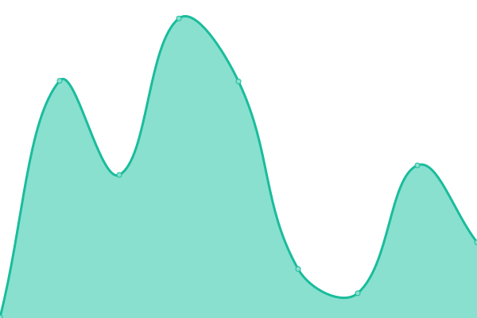
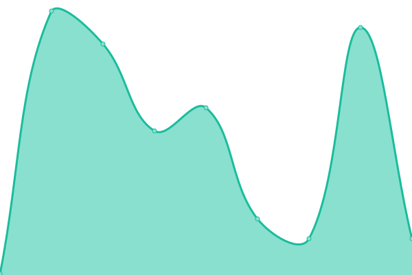

# [📈 Live Status](https://chronwire.github.io/chronwire-upptime): <!--live status--> **🟥 Complete outage**

This repository contains the open-source uptime monitor and status page for [chronwire](https://chronwire.github.io/chronwire-upptime), powered by [Upptime](https://github.com/upptime/upptime).

With [Upptime](https://upptime.js.org), you can get your own unlimited and free uptime monitor and status page, powered entirely by a GitHub repository. We use [Issues](https://github.com/chronwire/chronwire-upptime/issues) as incident reports, [Actions](https://github.com/chronwire/chronwire-upptime/actions) as uptime monitors, and [Pages](https://chronwire.github.io/chronwire-upptime) for the status page.

<!--start: status pages-->
<!-- This summary is generated by Upptime (https://github.com/upptime/upptime) -->
<!-- Do not edit this manually, your changes will be overwritten -->
<!-- prettier-ignore -->
| URL | Status | History | Response Time | Uptime |
| --- | ------ | ------- | ------------- | ------ |
|  [chronwire](https://chronwire.com) | 🟥 Down | [chronwire.yml](https://github.com/chronwire/chronwire-upptime/commits/HEAD/history/chronwire.yml) | 

 0ms
     
 | 

<a href="https://chronwire.github.io/chronwire-upptime/history/chronwire">0.00%</a>
    

|  [chronwire (API)](https://chronwire.com/api/v1/tags/top?search="") | 🟥 Down | [chronwire-api.yml](https://github.com/chronwire/chronwire-upptime/commits/HEAD/history/chronwire-api.yml) | 

 0ms
     
 | 

<a href="https://chronwire.github.io/chronwire-upptime/history/chronwire-api">0.00%</a>
    

<!--end: status pages-->

[**Visit our status website →**](https://chronwire.github.io/chronwire-upptime)

## 📄 License

- Powered by: [Upptime](https://github.com/upptime/upptime)
- Code: [MIT](./LICENSE) © [chronwire](https://chronwire.github.io/chronwire-upptime)
- Data in the `./history` directory: [Open Database License](https://opendatacommons.org/licenses/odbl/1-0/)
